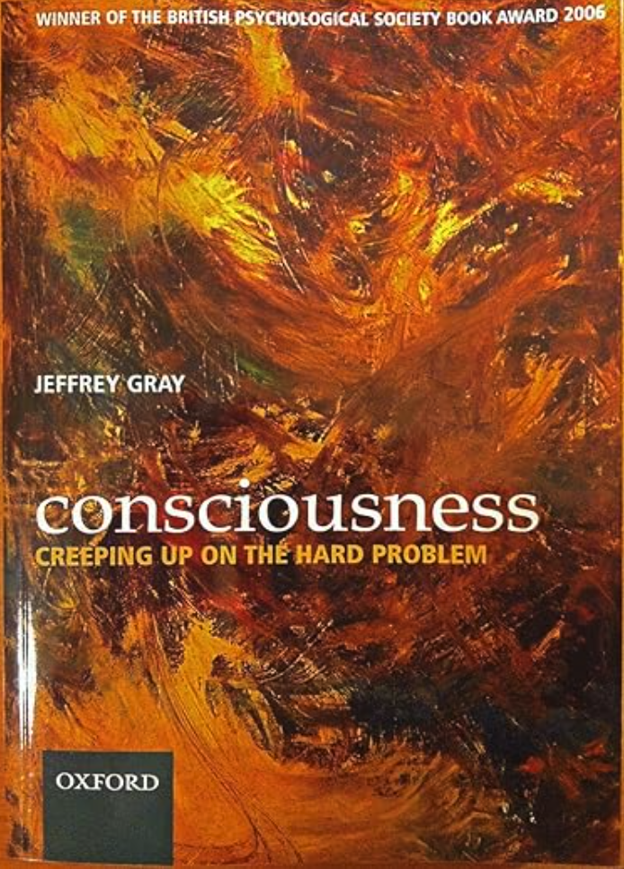

## HBF-meeting-20250826

The opening presentation this Fall semester will be delivered by Associate Professor Emeritus Bolek Srebro, a distinguished scholar, educator, and pioneering neuroscience researcher at the Department of Biomedicine.

The talk by Bolek will take place at a **new venue for the HBF seminar series**: the [**Eitri**](https://www.eitri.health) Incubator, located [here](http://maps.google.com/?q=31%20Haukelandsbakken%20Bergen,%20Vestland,%205021%20Norway), close to the BBB building's 8th floor and the  [Ulriken cable car](https://en.visitbergen.com/things-to-do/_ga=2.19682875.2039618291.1749723536-937718574.1749723536). The HBF seminar will meet at the Eitri venue on the last Tuesday of each month from August through November, 15:00-16:00 (unless otherwise announced).

#### Speaker: [Bolek Srebro](https://www4.uib.no/en/find-employees/Boleslaw.Srebro)

**Bio**: 
 Boleslaw "Bolek" Srebro is an emeritus researcher at the University of Bergen, Norway, who made significant contributions to neuroscience research focusing on hippocampal function and spatial memory. He earned his MSc in Psychology from the University of Warsaw (1960-1965) and subsequently completed his DSc in Neuroscience at the prestigious Nencki Institute of Experimental Biology (1966-1969), where he was a PhD student. His primary research area involved electrophysiological studies in freely exploring rats, specifically examining place cell properties and place field stability with or without reward as motivational factors. Srebro conducted pioneering work on how motivation and free exploration influence the firing properties of place cells in the CA1 area of the rat hippocampus, contributing to our understanding of how the brain creates cognitive maps for spatial navigation. His notable publications include studies on BDNF-induced lasting potentiation of synaptic transmission in the rat dentate gyrus (1998) and research on delta opioid receptor activation required to induce long-term potentiation of synaptic transmission in the lateral perforant path (1991). Srebro also investigated gene expression profiles in rat brain that disclose CNS signature genes and regional patterns of functional specialization, and worked on chromogranin A peptides and their effects on endothelial cell function. His research methodology involved sophisticated electrophysiological recordings from freely moving animals, a technique that was instrumental in advancing our understanding of how individual neurons respond to spatial navigation and environmental exploration, work that contributed to the foundational research later recognized in the 2014 Nobel Prize for discoveries of cells that constitute a positioning system in the brain.

#### Title of the talk: “Consciousness according to Jeffrey Gray*"  [[slides](https://docs.google.com/presentation/d/e/2PACX-1vSIJslGnxuIuQjucdnPY2olFvriqsB_yUV3Rlo-1y5D5Kdw2_Ffwu8cxBbbxNRjuCekBsn8jk08lcSf/pub?start=false&loop=false&delayms=3000)]

*) Jeffrey Gray. _Consciousness: Creeping up on the Hard Problem_. Oxford University Press, 2004.

**A review of the book:** 
"The late Professor Emeritus Jeffrey Gray is one to be remembered well. He is known for many things, including being of the most highly cited experimental psychologists in the UK to generating theories of human consciousness... This book is the culmination of Gray's long-standing quest for understanding the essential properties of consciousness... Gray's book is well worth the read. His coverage of models that address the hard problem of consciousness is reasonably complete. Gray is highly skilled at thoroughly critiquing each model (always finding both strengths and weaknesses). He gives the same constructive criticism to each model, in exactly the same measure he gives his own. His style is entirely fair-minded and refreshing... This is an excellent book that comes at the conclusion of the life of an outstanding member of academia. It is a timeless addition to any library for this reason alone." _-Science and Consciousness Review_

**Short description (from [[OUP](https://global.oup.com/academic/product/consciousness-9780198520917)]):** 

How does conscious experience arise out of the functioning of the human brain? How is it related to the behaviour that it accompanies? How does the perceived world relate to the real world? Between them, these three questions constitute what is commonly known as the Hard Problem of consciousness. Despite vast knowledge of the relationship between brain and behaviour, and rapid advances in our knowledge of how brain activity correlates with conscious experience, the answers to all three questions remain controversial, even mysterious. This important book analyses these core issues and reviews the evidence from both introspection and experiment. To many its conclusions will be surprising and even unsettling:

- The entire perceived world is constructed by the brain. The relationship between the world we perceive and the underlying physical reality is not as close as we might think

- Much of our behaviour is accomplished with little or no participation from conscious experience.

- Our conscious experience of our behaviour lags the behaviour itself by around a fifth of a second - we become aware of what we do only after we have done it.

- The lag in conscious experience applies also to the decision to act - we only become aware of our decisions after they have been formed.

- The self is as much a creation of the brain as is the rest of the perceived world.
