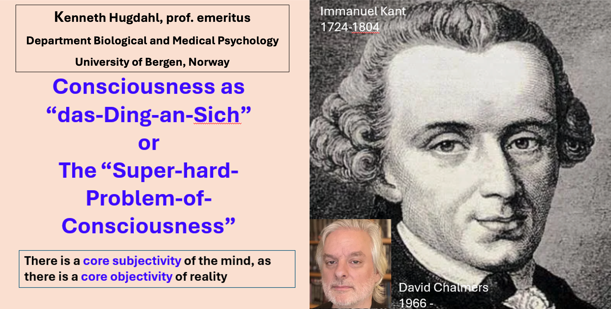
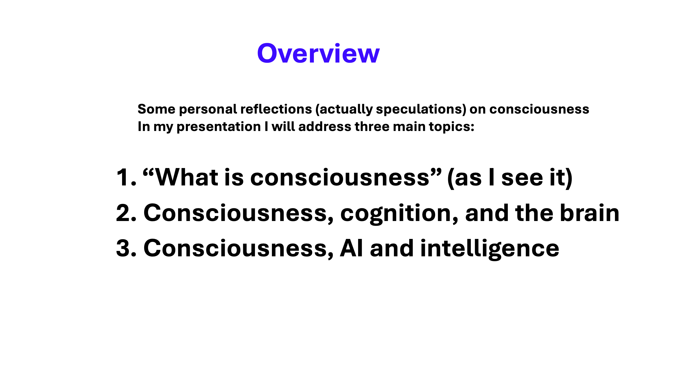

## HBF-meeting-20251125

We are pleased to announce that Professor em. [Kenneth Hugdahl](https://www4.uib.no/en/find-employees/Kenneth.Hugdahl) from the Department of Biological and Medical Psychology, UiB will be giving a talk on November 25, 3:00 pm, at our usual venue: Golgi 1, Eitri incubator. A teaser is provided below.

Prof. Hugdahl is one of Norway's most distinguished and prolific psychologists and cognitive neuroscientists ([Wikipedia](https://en.wikipedia.org/wiki/Kenneth_Hugdahl), [GoogleScholar](https://scholar.google.com/citations?user=mo38n1UAAAAJ&hl=en)). He is among the few scientists to have received grants from both the MacArthur Foundation (Mind-Body Network, 1990–2000) and the European Research Council—twice, with Advanced Grants for [ERC1-VOICE](https://erc.europa.eu/projects-statistics/science-stories/silencing-your-inner-voices) and [ERC2-ONOFF](https://erc.europa.eu/projects-statistics/science-stories/erc-research-lends-ear-voices-heard-schizophrenia-patients). He is also a member of [Academia Europaea](https://www.ae-info.org/ae/Member/Hugdahl_Kenneth).

### Kenneth Hugdahl

#### Title: “Consciousness as «das ding-an-sich” or The super-hard problem of consciousness" [[slides (download)](HBF_Hugdahl_20251125.pptx)] 
**Teaser:** 

Open to everyone!

The HBF team

-------

For previous talks and presenters see: https://github.com/Brain-and-Consciousness/HBF